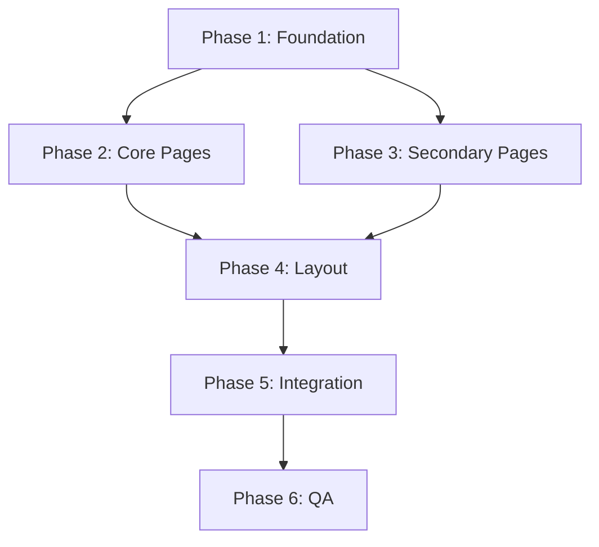

# WUKSY Mobile Responsiveness - Multi-Agent Implementation Plan

**Purpose:** Break down mobile responsiveness improvements into discrete tasks that can be executed by multiple AI agents working in parallel or sequence.

**Execution Model:** Each agent receives a specific prompt, has access to necessary files, and produces defined outputs. Agents can work independently where there are no dependencies.

---

## Agent Architecture Overview

### Agent Types & Specializations

1. **Foundation Agents** - Core component improvements (no dependencies)
2. **Page Optimization Agents** - Page-specific fixes (depend on Foundation)
3. **Integration Agents** - Cross-cutting features (depend on Page optimizations)
4. **Quality Assurance Agents** - Testing and validation (depend on all)

### Execution Phases

```
Phase 1: Foundation (Parallel)
├── Agent 1A: UI Components
├── Agent 1B: Utility Hooks
└── Agent 1C: Style System

Phase 2: Core Pages (Parallel after Phase 1)
├── Agent 2A: Dashboard
├── Agent 2B: Upload
├── Agent 2C: Documents
├── Agent 2D: Analysis
└── Agent 2E: Biomarkers

Phase 3: Secondary Pages (Parallel after Phase 1)
├── Agent 3A: Auth Pages
├── Agent 3B: Profile
├── Agent 3C: How It Works
└── Agent 3D: Coming Soon

Phase 4: Layout Components (After Phase 2-3)
├── Agent 4A: Header
└── Agent 4B: Footer

Phase 5: Integration (After Phase 4)
├── Agent 5A: Accessibility
└── Agent 5B: Animation Optimization

Phase 6: Quality Assurance (After all)
├── Agent 6A: Testing
└── Agent 6B: Documentation
```

---

## PHASE 1: FOUNDATION AGENTS

### Agent 1A: UI Components Enhancement

**Objective:** Improve core UI components for mobile responsiveness

**Input Files:**
- `src/components/ui/Button.tsx`
- `src/components/ui/Card.tsx` (if exists)
- `src/components/ui/Input.tsx` (if exists)

**Dependencies:** None

**Prompt:**

```
You are tasked with improving mobile responsiveness for the core UI components in a Next.js/React application. Focus on touch targets, mobile-specific styling, and accessibility.

FILES TO MODIFY:
1. src/components/ui/Button.tsx

REQUIREMENTS:

1. BUTTON COMPONENT IMPROVEMENTS:
   - Add minimum touch target size (44×44px) for all button variants
   - Create responsive size variants: 'sm', 'md', 'lg' with proper mobile scaling
   - Add active/press state styling (not just hover) for touch devices
   - Ensure proper spacing between adjacent buttons (at least 8px gap)
   - Add ARIA labels where needed

2. CODE PATTERNS TO IMPLEMENT:

For Button.tsx:
```tsx
// Add to button className
const sizeClasses = {
  sm: 'min-h-[44px] px-4 text-sm',  // Still meets 44px touch target
  md: 'min-h-[44px] px-6 text-base', // Default
  lg: 'min-h-[48px] px-8 text-lg',   // Larger target
}

// Add active state for mobile
'active:scale-95 transition-transform'
```

3. CREATE NEW COMPONENT:
   Create src/components/ui/ResponsiveModal.tsx with:
   - Full-screen on mobile (<768px)
   - Centered with max-width on desktop
   - Backdrop tap to close
   - Proper focus management
   - Close button with adequate touch target

EXAMPLE MODAL IMPLEMENTATION:
```tsx
interface ResponsiveModalProps {
  isOpen: boolean
  onClose: () => void
  children: React.ReactNode
  title?: string
}

export function ResponsiveModal({ isOpen, onClose, children, title }: ResponsiveModalProps) {
  if (!isOpen) return null
  
  return (
    <div className="fixed inset-0 z-50">
      {/* Backdrop */}
      <div 
        className="absolute inset-0 bg-black/50 backdrop-blur-sm"
        onClick={onClose}
        aria-hidden="true"
      />
      
      {/* Modal */}
      <div 
        className="absolute inset-0 md:inset-auto md:top-1/2 md:left-1/2 md:-translate-x-1/2 md:-translate-y-1/2 md:max-w-2xl md:max-h-[90vh] md:rounded-2xl bg-white overflow-y-auto"
        role="dialog"
        aria-modal="true"
        aria-labelledby={title ? "modal-title" : undefined}
      >
        <button
          className="absolute top-4 right-4 p-3 rounded-full hover:bg-neutral-100 min-h-[44px] min-w-[44px] flex items-center justify-center"
          onClick={onClose}
          aria-label="Close modal"
        >
          <X className="h-5 w-5" />
        </button>
        <div className="p-6 md:p-8">
          {title && <h2 id="modal-title" className="text-2xl font-medium mb-4">{title}</h2>}
          {children}
        </div>
      </div>
    </div>
  )
}
```

4. TESTING CHECKLIST:
   - [ ] All buttons have minimum 44×44px touch target
   - [ ] Active/press states visible on mobile
   - [ ] Modal full-screen on mobile (test at 375px width)
   - [ ] Modal centered on desktop (test at 1024px width)
   - [ ] Backdrop closes modal
   - [ ] Close button easy to tap (44×44px minimum)

OUTPUT:
- Modified Button.tsx with touch target improvements
- New ResponsiveModal.tsx component
- List of any breaking changes or API modifications
```

**Expected Output:**
- Modified `src/components/ui/Button.tsx`
- New `src/components/ui/ResponsiveModal.tsx`
- Change log document

**Success Criteria:**
- All buttons meet 44×44px minimum
- Modal works on mobile and desktop
- No TypeScript errors

---

### Agent 1B: Utility Hooks Creation

**Objective:** Create reusable hooks for mobile-specific functionality

**Input Files:** None (creating new files)

**Dependencies:** None

**Prompt:**

```
You are creating utility hooks for mobile responsiveness in a Next.js/React application.

CREATE THESE HOOKS:

1. src/hooks/useReducedMotion.ts
   - Detect user's motion preferences
   - Return boolean: prefersReducedMotion
   - Listen for changes dynamically

2. src/hooks/useBreakpoint.ts
   - Detect current breakpoint (xs, sm, md, lg, xl)
   - Return current breakpoint name
   - Update on window resize

3. src/hooks/useTouchDevice.ts
   - Detect if device supports touch
   - Return boolean: isTouchDevice
   - Consider hover capability

IMPLEMENTATION:

```tsx
// src/hooks/useReducedMotion.ts
import { useEffect, useState } from 'react'

export function useReducedMotion(): boolean {
  const [prefersReducedMotion, setPrefersReducedMotion] = useState(false)
  
  useEffect(() => {
    const mediaQuery = window.matchMedia('(prefers-reduced-motion: reduce)')
    setPrefersReducedMotion(mediaQuery.matches)
    
    const listener = (e: MediaQueryListEvent) => {
      setPrefersReducedMotion(e.matches)
    }
    
    mediaQuery.addEventListener('change', listener)
    return () => mediaQuery.removeEventListener('change', listener)
  }, [])
  
  return prefersReducedMotion
}

// src/hooks/useBreakpoint.ts
import { useEffect, useState } from 'react'

type Breakpoint = 'xs' | 'sm' | 'md' | 'lg' | 'xl' | '2xl'

const breakpoints = {
  xs: 0,
  sm: 640,
  md: 768,
  lg: 1024,
  xl: 1280,
  '2xl': 1536,
}

export function useBreakpoint(): Breakpoint {
  const [breakpoint, setBreakpoint] = useState<Breakpoint>('md')
  
  useEffect(() => {
    const updateBreakpoint = () => {
      const width = window.innerWidth
      if (width < breakpoints.sm) setBreakpoint('xs')
      else if (width < breakpoints.md) setBreakpoint('sm')
      else if (width < breakpoints.lg) setBreakpoint('md')
      else if (width < breakpoints.xl) setBreakpoint('lg')
      else if (width < breakpoints['2xl']) setBreakpoint('xl')
      else setBreakpoint('2xl')
    }
    
    updateBreakpoint()
    window.addEventListener('resize', updateBreakpoint)
    return () => window.removeEventListener('resize', updateBreakpoint)
  }, [])
  
  return breakpoint
}

// src/hooks/useTouchDevice.ts
import { useEffect, useState } from 'react'

export function useTouchDevice(): boolean {
  const [isTouchDevice, setIsTouchDevice] = useState(false)
  
  useEffect(() => {
    const hasTouchScreen = 
      'ontouchstart' in window ||
      navigator.maxTouchPoints > 0 ||
      // @ts-ignore
      navigator.msMaxTouchPoints > 0
    
    const hasCoarsePointer = window.matchMedia('(pointer: coarse)').matches
    
    setIsTouchDevice(hasTouchScreen || hasCoarsePointer)
  }, [])
  
  return isTouchDevice
}
```

4. CREATE COMPONENT: src/components/ui/ExpandableText.tsx
   - Reusable text truncation with "Show more"
   - Line clamp support
   - Smooth animation

```tsx
import { useState } from 'react'

interface ExpandableTextProps {
  text: string
  maxLines?: number
  className?: string
  expandText?: string
  collapseText?: string
}

export function ExpandableText({ 
  text, 
  maxLines = 3, 
  className = '',
  expandText = 'Show more',
  collapseText = 'Show less'
}: ExpandableTextProps) {
  const [expanded, setExpanded] = useState(false)
  
  return (
    <div className={className}>
      <p className={expanded ? '' : `line-clamp-${maxLines}`}>
        {text}
      </p>
      <button
        onClick={() => setExpanded(!expanded)}
        className="text-primary-600 hover:text-primary-700 text-sm mt-2 font-medium"
      >
        {expanded ? collapseText : expandText}
      </button>
    </div>
  )
}
```

OUTPUT:
- Three new hooks in src/hooks/
- ExpandableText component
- Usage examples for each

TESTING:
- Test useReducedMotion by enabling "Reduce Motion" in OS
- Test useBreakpoint by resizing browser window
- Test useTouchDevice on desktop and mobile
- Test ExpandableText with various line clamp values
```

**Expected Output:**
- `src/hooks/useReducedMotion.ts`
- `src/hooks/useBreakpoint.ts`
- `src/hooks/useTouchDevice.ts`
- `src/components/ui/ExpandableText.tsx`
- Usage examples document

**Success Criteria:**
- All hooks work correctly
- No TypeScript errors
- Hooks are properly typed

---

### Agent 1C: Style System Enhancement

**Objective:** Add mobile-specific utilities to CSS

**Input Files:**
- `src/app/globals.css`
- `tailwind.config.js`

**Dependencies:** None

**Prompt:**

```
You are enhancing the CSS utility system for better mobile responsiveness in a Next.js application using Tailwind CSS.

FILES TO MODIFY:
1. src/app/globals.css
2. tailwind.config.js (if needed)

TASKS:

1. ADD TO globals.css (in @layer utilities):

```css
@layer utilities {
  /* Line clamp utilities - ensure these exist */
  .line-clamp-1 {
    overflow: hidden;
    display: -webkit-box;
    -webkit-box-orient: vertical;
    -webkit-line-clamp: 1;
  }
  
  .line-clamp-2 {
    overflow: hidden;
    display: -webkit-box;
    -webkit-box-orient: vertical;
    -webkit-line-clamp: 2;
  }
  
  .line-clamp-3 {
    overflow: hidden;
    display: -webkit-box;
    -webkit-box-orient: vertical;
    -webkit-line-clamp: 3;
  }
  
  .line-clamp-4 {
    overflow: hidden;
    display: -webkit-box;
    -webkit-box-orient: vertical;
    -webkit-line-clamp: 4;
  }
  
  /* Touch target minimum */
  .touch-target {
    @apply min-h-[44px] min-w-[44px];
  }
  
  .touch-target-lg {
    @apply min-h-[48px] min-w-[48px];
  }
  
  /* Safe area for mobile notches/home indicator */
  .safe-area-top {
    padding-top: env(safe-area-inset-top);
  }
  
  .safe-area-bottom {
    padding-bottom: env(safe-area-inset-bottom);
  }
  
  .safe-area-left {
    padding-left: env(safe-area-inset-left);
  }
  
  .safe-area-right {
    padding-right: env(safe-area-inset-right);
  }
  
  /* Prevent horizontal scroll on mobile */
  .no-scrollbar::-webkit-scrollbar {
    display: none;
  }
  
  .no-scrollbar {
    -ms-overflow-style: none;
    scrollbar-width: none;
  }
  
  /* Mobile-optimized spacing */
  .mobile-padding {
    @apply px-4 py-6 sm:px-6 sm:py-8 md:px-8 md:py-12;
  }
  
  /* Responsive text sizes */
  .text-mobile-h1 {
    @apply text-2xl leading-tight sm:text-3xl md:text-4xl;
  }
  
  .text-mobile-h2 {
    @apply text-xl leading-tight sm:text-2xl md:text-3xl;
  }
  
  .text-mobile-h3 {
    @apply text-lg leading-tight sm:text-xl md:text-2xl;
  }
  
  /* Stack on mobile, flex on desktop */
  .stack-mobile {
    @apply flex flex-col md:flex-row;
  }
}
```

2. UPDATE tailwind.config.js:
   - Add 'xs' breakpoint for very small phones (375px)
   - Verify all breakpoints are present

```js
module.exports = {
  theme: {
    screens: {
      'xs': '375px',   // iPhone SE and similar
      'sm': '640px',
      'md': '768px',
      'lg': '1024px',
      'xl': '1280px',
      '2xl': '1536px',
    },
    extend: {
      // ... existing theme extensions
    },
  },
}
```

3. VERIFY EXISTING STYLES:
   - Check that zen-text, zen-gradient classes still work
   - Ensure health score classes are mobile-friendly
   - Verify card-hover has mobile alternative (active state)

OUTPUT:
- Modified globals.css with new utilities
- Modified tailwind.config.js (if needed)
- Documentation of new utility classes
```

**Expected Output:**
- Modified `src/app/globals.css`
- Modified `tailwind.config.js` (if needed)
- Utility class reference document

**Success Criteria:**
- All new utilities compile without errors
- Utilities work as expected in browser
- No conflicts with existing styles

---

## PHASE 2: CORE PAGE OPTIMIZATION AGENTS

### Agent 2A: Dashboard Page Optimization

**Objective:** Optimize Dashboard page for mobile

**Input Files:**
- `src/app/dashboard/page.tsx`
- New components from Phase 1

**Dependencies:** Phase 1 (Agent 1A, 1B)

**Prompt:**

```
You are optimizing the Dashboard page for mobile responsiveness. You have access to new utility hooks (useReducedMotion, useBreakpoint) and components (ExpandableText, ResponsiveModal) from Phase 1.

FILE TO MODIFY:
- src/app/dashboard/page.tsx

SPECIFIC CHANGES:

1. STATS GRID (Lines ~293-318):
   Change from 2×2 grid to vertical stack on mobile

BEFORE:
```tsx
<div className="grid grid-cols-2 md:grid-cols-4 gap-6">
  <div className="text-center">
    <div className="text-2xl font-light zen-text mb-2">
      {stats?.averageScore || 0}
    </div>
    <div className="text-sm text-neutral-600">Wellness Score</div>
  </div>
  // ... more stats
</div>
```

AFTER:
```tsx
<div className="flex flex-col gap-4 sm:grid sm:grid-cols-2 md:grid-cols-4 md:gap-6">
  <div className="text-center">
    <div className="text-xl sm:text-2xl font-light zen-text mb-2">
      {stats?.averageScore || 0}
    </div>
    <div className="text-sm text-neutral-600">Wellness Score</div>
  </div>
  // ... more stats
</div>
```

2. TODAY'S INSIGHT (Lines ~418-442):
   Use ExpandableText component to truncate long text

BEFORE:
```tsx
<p className="text-sm text-neutral-600 mb-6 leading-relaxed">
  Your body speaks in whispers through your biomarkers. 
  Listen gently and respond with kindness.
</p>
```

AFTER:
```tsx
import { ExpandableText } from '@/components/ui/ExpandableText'

<ExpandableText
  text="Your body speaks in whispers through your biomarkers. Listen gently and respond with kindness."
  maxLines={2}
  className="text-sm text-neutral-600 mb-6 leading-relaxed"
/>
```

3. SUPPORT SECTION (Lines ~486-501):
   Make collapsible on mobile

```tsx
const [showSupport, setShowSupport] = useState(false)
const breakpoint = useBreakpoint()
const isMobile = breakpoint === 'xs' || breakpoint === 'sm'

// In render:
<Card className="p-6">
  <button
    onClick={() => setShowSupport(!showSupport)}
    className="w-full text-left flex items-center justify-between"
  >
    <h3 className="font-medium text-neutral-800">Caring Support</h3>
    {isMobile && (
      <ChevronDown 
        className={`h-4 w-4 transition-transform ${showSupport ? 'rotate-180' : ''}`}
      />
    )}
  </button>
  
  {(showSupport || !isMobile) && (
    <>
      <p className="text-sm text-neutral-600 mt-4 mb-6 leading-relaxed">
        Questions about your journey? Our caring team is here to guide you 
        with patience and understanding.
      </p>
      <Button variant="outline" size="sm" className="w-full">
        Get Support
      </Button>
    </>
  )}
</Card>
```

4. ADD REDUCED MOTION:
   Apply useReducedMotion to all Framer Motion animations

```tsx
const prefersReducedMotion = useReducedMotion()

<motion.div
  initial={prefersReducedMotion ? {} : { opacity: 0, y: 20 }}
  animate={prefersReducedMotion ? {} : { opacity: 1, y: 0 }}
  transition={{ duration: 0.8 }}
>
```

5. RESPONSIVE PADDING:
   Reduce padding on mobile

Line 206:
```tsx
<div className="max-w-6xl mx-auto px-4 sm:px-6 lg:px-8 py-8 sm:py-12">
```

TESTING CHECKLIST:
- [ ] Stats display correctly on mobile (375px width)
- [ ] Today's Insight truncates and expands properly
- [ ] Support section collapses on mobile
- [ ] All animations respect reduced motion preference
- [ ] Page loads without errors
- [ ] Touch targets are adequate

OUTPUT:
- Modified dashboard/page.tsx
- Screenshots showing before/after on mobile (if possible)
- List of changes made
```

**Expected Output:**
- Modified `src/app/dashboard/page.tsx`
- Change documentation
- Test results

**Success Criteria:**
- Page works on 375px width
- No horizontal scroll
- All interactions work on touch

---

### Agent 2B: Upload Page Optimization

**Objective:** Optimize Upload page for mobile

**Input Files:**
- `src/app/upload/page.tsx`
- Components from Phase 1

**Dependencies:** Phase 1 (All foundation agents)

**Prompt:**

```
You are optimizing the Upload page for mobile responsiveness.

FILE TO MODIFY:
- src/app/upload/page.tsx

CRITICAL CHANGES:

1. DROPZONE AREA (Lines ~413-441):
   Reduce padding and icon size on mobile

BEFORE:
```tsx
<div className="border-2 border-dashed rounded-lg p-12 text-center...">
  <div className="bg-primary-100 p-6 rounded-full">
    <Upload className="h-12 w-12 text-primary-600" />
  </div>
</div>
```

AFTER:
```tsx
<div className="border-2 border-dashed rounded-lg p-6 sm:p-8 md:p-12 text-center...">
  <div className="bg-primary-100 p-4 sm:p-6 rounded-full">
    <Upload className="h-8 w-8 sm:h-10 sm:w-10 md:h-12 md:w-12 text-primary-600" />
  </div>
  <div>
    <h3 className="text-lg sm:text-xl font-medium text-neutral-800 mb-2">
      {isDragActive ? 'Drop your files here' : 'Upload your blood test results'}
    </h3>
  </div>
</div>
```

2. FILE PROCESSING CARDS (Lines ~457-546):
   Simplify progress UI on mobile

Key changes:
- Reduce min-height of progress section
- Collapse AI reasoning by default on mobile
- Show only essential metrics

```tsx
const breakpoint = useBreakpoint()
const isMobile = breakpoint === 'xs' || breakpoint === 'sm'

// In progress UI:
<div className={`space-y-3 p-4 bg-gradient-to-r from-blue-50 to-indigo-50 rounded-lg border border-blue-100 ${
  isMobile ? 'min-h-[8rem]' : 'min-h-[12rem]'
} flex flex-col justify-between`}>
```

3. SUPPORTED FORMATS SECTION (Lines ~369-402):
   Stack vertically on small mobile

```tsx
<div className="grid grid-cols-1 sm:grid-cols-2 md:grid-cols-3 gap-4">
  <div className="flex items-center space-x-3">
    <div className="bg-primary-50 p-2 rounded-lg flex-shrink-0">
      <FileText className="h-5 w-5 text-primary-600" />
    </div>
    <div className="min-w-0">
      <div className="font-medium text-neutral-800 text-sm sm:text-base">PDF Documents</div>
      <div className="text-xs sm:text-sm text-neutral-600 truncate">Lab reports, test results</div>
    </div>
  </div>
  {/* ... other formats */}
</div>
```

4. AI REASONING COLLAPSE:
   Make AI reasoning collapsed by default on mobile

```tsx
const [expandedReasoning, setExpandedReasoning] = useState<{[key: string]: boolean}>({})

// Only expand on desktop by default
useEffect(() => {
  if (!isMobile && fileObj.aiMetrics?.thoughtProcess) {
    setExpandedReasoning(prev => ({ ...prev, [fileObj.id]: true }))
  }
}, [fileObj.aiMetrics, isMobile, fileObj.id])
```

5. HEADER SECTION:
   Reduce text size on mobile

Lines 347-360:
```tsx
<h1 className="text-2xl sm:text-3xl font-light text-neutral-800 mb-4">
  Upload Your Blood Test Results
</h1>
<p className="text-base sm:text-lg text-neutral-600 max-w-2xl mx-auto">
  Share your blood test documents with us. Our AI will carefully analyze 
  your biomarkers and provide personalized wellness insights.
</p>
```

TESTING:
- [ ] Dropzone looks good on 375px width
- [ ] File upload progress displays correctly
- [ ] AI reasoning can be expanded/collapsed
- [ ] No horizontal scroll
- [ ] All touch targets adequate
- [ ] Privacy notice card displays properly

OUTPUT:
- Modified upload/page.tsx
- Documentation of changes
- Mobile screenshots (if possible)
```

**Expected Output:**
- Modified `src/app/upload/page.tsx`
- Change log
- Test results

---

### Agent 2C: Documents Page Optimization

**Objective:** Simplify documents page for mobile

**Input Files:**
- `src/app/documents/page.tsx`
- Components from Phase 1

**Dependencies:** Phase 1

**Prompt:**

```
You are simplifying the Documents page for mobile. This is a complex page with document cards that contain multiple nested sections.

FILE TO MODIFY:
- src/app/documents/page.tsx

CRITICAL SIMPLIFICATIONS:

1. BIOMARKER PREVIEW (Lines ~598-631):
   Show only 3 biomarkers on mobile instead of 6

BEFORE:
```tsx
{document.biomarker_readings.slice(0, 6).map((biomarker, idx) => (
```

AFTER:
```tsx
const breakpoint = useBreakpoint()
const isMobile = breakpoint === 'xs' || breakpoint === 'sm'
const biomarkerLimit = isMobile ? 3 : 6

// In render:
{document.biomarker_readings.slice(0, biomarkerLimit).map((biomarker, idx) => (
```

2. ANALYSIS SUMMARY (Lines ~634-655):
   Make collapsible on mobile

```tsx
const [expandedAnalysis, setExpandedAnalysis] = useState<{[key: string]: boolean}>({})

// In document card:
{document.analysis && (
  <div className="bg-gradient-to-r from-primary-50 to-sage-50 p-4 rounded-lg">
    <button
      onClick={() => setExpandedAnalysis(prev => ({
        ...prev,
        [document.id]: !prev[document.id]
      }))}
      className="w-full text-left flex items-center justify-between sm:cursor-default"
    >
      <div>
        <h4 className="text-sm font-medium text-neutral-800 mb-1">
          Health Analysis Available
        </h4>
        {isMobile && !expandedAnalysis[document.id] && (
          <div className="text-xs text-neutral-600">
            Tap to view details
          </div>
        )}
      </div>
      {isMobile && (
        <ChevronDown 
          className={`h-4 w-4 transition-transform ${
            expandedAnalysis[document.id] ? 'rotate-180' : ''
          }`}
        />
      )}
    </button>
    
    {(expandedAnalysis[document.id] || !isMobile) && (
      <div className="flex items-center justify-between mt-3">
        <div className="flex items-center space-x-4 text-sm text-neutral-600">
          <span>Score: {document.analysis.overall_health_score}/100</span>
          <span className="capitalize">{document.analysis.health_category}</span>
          <span className="hidden sm:inline">{formatDate(document.analysis.created_at)}</span>
        </div>
        <Link href={`/analysis/${document.analysis.id}`}>
          <Button variant="outline" size="sm">
            <Eye className="mr-2 h-4 w-4" />
            <span className="hidden sm:inline">View Analysis</span>
            <span className="sm:hidden">View</span>
          </Button>
        </Link>
      </div>
    )}
  </div>
)}
```

3. PROGRESS UI (Lines ~672-794):
   Reduce min-height on mobile

Line 672:
```tsx
<div className={`space-y-3 p-4 bg-gradient-to-r from-blue-50 to-indigo-50 rounded-lg border border-blue-100 ${
  isMobile ? 'min-h-[10rem]' : 'min-h-[12rem]'
} flex flex-col justify-between`}>
```

4. DOCUMENT METADATA (Lines ~576-589):
   Wrap metadata on mobile

```tsx
<div className="flex flex-col sm:flex-row sm:items-center sm:space-x-4 text-sm text-neutral-600 space-y-2 sm:space-y-0">
  <span className="flex items-center">
    <Calendar className="h-4 w-4 mr-1" />
    {formatDate(document.uploaded_at)}
  </span>
  <span className="hidden sm:inline">{formatFileSize(document.filesize)}</span>
  <div className={`flex items-center px-2 py-1 rounded-full ${status.bgColor}`}>
    <StatusIcon className={`h-3 w-3 mr-1 ${status.color}`} />
    <span className={`text-xs font-medium ${status.color}`}>
      {status.text}
    </span>
  </div>
</div>
```

5. ACTION BUTTONS:
   Move to top of card on mobile for easier access

```tsx
<Card className="p-6">
  {/* Mobile: Actions at top */}
  <div className="sm:hidden mb-4">
    {/* Action buttons here */}
  </div>
  
  {/* Document content */}
  <div className="flex items-start justify-between">
    <div className="flex-1">
      {/* Document details */}
    </div>
    
    {/* Desktop: Actions on side */}
    <div className="hidden sm:flex sm:flex-col sm:space-y-2 ml-6">
      {/* Action buttons here */}
    </div>
  </div>
</Card>
```

TESTING:
- [ ] Document cards display correctly on mobile
- [ ] Only 3 biomarkers shown on mobile
- [ ] Analysis summary collapses on mobile
- [ ] Action buttons accessible
- [ ] No horizontal scroll
- [ ] All touch targets adequate

OUTPUT:
- Modified documents/page.tsx
- Change documentation
```

**Expected Output:**
- Modified `src/app/documents/page.tsx`
- Change log

---

### Agent 2D: Analysis Page Simplification

**Objective:** Major simplification of the Analysis detail page (most complex page)

**Input Files:**
- `src/app/analysis/[id]/page.tsx` (1,954 lines!)
- Components from Phase 1

**Dependencies:** Phase 1

**Prompt:**

```
You are simplifying the most complex page in the application - the Analysis detail page. This page has 1,954 lines of code with deeply nested structures. The goal is to reduce information density on mobile while maintaining functionality.

FILE TO MODIFY:
- src/app/analysis/[id]/page.tsx

APPROACH:
This page needs significant restructuring. Focus on these key areas:

1. TAB NAVIGATION:
   - Ensure tabs are scrollable if they overflow
   - Make tab labels shorter on mobile

2. BIOMARKER SECTION:
   - Show only priority biomarkers by default (deficient, concerning, suboptimal)
   - Add "Show all biomarkers" button
   - Simplify expanded biomarker details

3. SUPPLEMENT SECTION:
   - Default to showing only "Essential" priority
   - Use ExpandableText for rationales
   - Collapse interaction warnings by default

4. LIFESTYLE SECTION:
   - Show one category at a time on mobile
   - Use tab switching instead of showing all
   - Truncate recommendation details

SPECIFIC CHANGES:

1. ADD PRIORITY FILTER FOR BIOMARKERS:

```tsx
const [showAllBiomarkers, setShowAllBiomarkers] = useState(false)
const breakpoint = useBreakpoint()
const isMobile = breakpoint === 'xs' || breakpoint === 'sm'

// Filter biomarkers
const priorityBiomarkers = analysis?.biomarker_insights?.filter(
  (b: any) => ['deficient', 'concerning', 'suboptimal'].includes(b.status?.toLowerCase())
) || []

const displayedBiomarkers = (showAllBiomarkers || !isMobile) 
  ? sortBiomarkersByStatus(analysis?.biomarker_insights || [])
  : priorityBiomarkers

// In render:
<div className="space-y-4">
  {displayedBiomarkers.map((biomarker, index) => (
    // ... biomarker card
  ))}
  
  {isMobile && priorityBiomarkers.length < (analysis?.biomarker_insights?.length || 0) && (
    <button
      onClick={() => setShowAllBiomarkers(!showAllBiomarkers)}
      className="w-full py-3 px-4 border-2 border-dashed border-neutral-300 rounded-lg text-neutral-600 hover:border-primary-400 hover:text-primary-600 transition-colors"
    >
      {showAllBiomarkers 
        ? 'Show priority biomarkers only' 
        : `Show all ${analysis?.biomarker_insights?.length} biomarkers`
      }
    </button>
  )}
</div>
```

2. SIMPLIFY BIOMARKER EXPANDED CONTENT:
   Use ExpandableText for long descriptions

```tsx
import { ExpandableText } from '@/components/ui/ExpandableText'

// In expanded biomarker:
<div className="mt-4 space-y-3">
  <ExpandableText
    text={biomarker.explanation || 'No detailed explanation available.'}
    maxLines={isMobile ? 3 : 5}
    className="text-sm text-neutral-600"
  />
</div>
```

3. SUPPLEMENT RATIONALE TRUNCATION:

```tsx
// In supplement card:
<ExpandableText
  text={supplement.rationale}
  maxLines={3}
  className="text-sm text-neutral-600 mt-2"
/>
```

4. LIFESTYLE RECOMMENDATIONS:
   Show fewer details by default

```tsx
// In lifestyle recommendation card:
<div className="space-y-2">
  <h4 className="font-medium text-neutral-800">{rec.title}</h4>
  <ExpandableText
    text={rec.description}
    maxLines={2}
    className="text-sm text-neutral-600"
  />
</div>
```

5. HEADER OPTIMIZATION:
   Reduce size on mobile

At top of file:
```tsx
<div className="max-w-6xl mx-auto px-4 sm:px-6 lg:px-8 py-8 sm:py-12">
  <div className="flex items-center space-x-4 mb-6 sm:mb-8">
    <Link href="/documents" className="text-neutral-600 hover:text-primary-600">
      <ArrowLeft className="h-5 w-5" />
    </Link>
    <div>
      <h1 className="text-2xl sm:text-3xl font-light text-neutral-800">Health Analysis</h1>
      <p className="text-sm sm:text-base text-neutral-600 mt-1">
        Detailed insights from your blood test
      </p>
    </div>
  </div>
```

6. SCROLLABLE TAB BAR:

```tsx
<div className="overflow-x-auto no-scrollbar mb-6">
  <div className="flex space-x-2 min-w-max pb-2">
    {tabs.map(tab => (
      <button
        key={tab.id}
        className={`px-4 py-2 rounded-lg font-medium text-sm whitespace-nowrap ${
          activeTab === tab.id
            ? 'bg-primary-500 text-white'
            : 'bg-neutral-100 text-neutral-600 hover:bg-neutral-200'
        }`}
        onClick={() => setActiveTab(tab.id)}
      >
        {tab.label}
      </button>
    ))}
  </div>
</div>
```

TESTING:
- [ ] Page loads without errors
- [ ] Priority biomarkers show first on mobile
- [ ] "Show all" button works
- [ ] Supplements display correctly
- [ ] Lifestyle recommendations readable
- [ ] Tabs are scrollable if needed
- [ ] No horizontal scroll on page
- [ ] Performance is acceptable (this is a large page)

NOTE: This page is very large and complex. Consider breaking it into smaller components in a future refactor:
- BiomarkerSection.tsx
- SupplementSection.tsx
- LifestyleSection.tsx
- OverviewSection.tsx

OUTPUT:
- Modified analysis/[id]/page.tsx
- Detailed change log
- Recommendations for further refactoring
```

**Expected Output:**
- Modified `src/app/analysis/[id]/page.tsx`
- Change log
- Refactoring recommendations

**Success Criteria:**
- Page is more readable on mobile
- Key information visible without excessive scrolling
- No performance degradation

---

### Agent 2E: Biomarkers Page Optimization

**Objective:** Optimize Biomarkers page for mobile

**Input Files:**
- `src/app/biomarkers/page.tsx`
- Components from Phase 1

**Dependencies:** Phase 1

**Prompt:**

```
You are optimizing the Biomarkers page for mobile responsiveness. The main issue is the sidebar appearing above content on mobile.

FILE TO MODIFY:
- src/app/biomarkers/page.tsx

KEY CHANGES:

1. SIDEBAR REORDERING (Lines ~238-616):
   Move sidebar to bottom on mobile

CHANGE STRUCTURE FROM:
```tsx
<div className="flex flex-col lg:flex-row gap-8">
  <div className="lg:col-span-2 space-y-8">
    {/* Main content */}
  </div>
  <div className="lg:w-80 flex-shrink-0 space-y-6">
    {/* Sidebar */}
  </div>
</div>
```

TO:
```tsx
<div className="flex flex-col lg:flex-row gap-8">
  {/* Main content - shows first on mobile, left on desktop */}
  <div className="order-2 lg:order-1 flex-1 min-w-0">
    {/* Main content here */}
  </div>
  
  {/* Sidebar - shows second on mobile, right on desktop */}
  <div className="order-1 lg:order-2 lg:w-80 flex-shrink-0 space-y-6">
    {/* Sidebar here */}
  </div>
</div>
```

2. FILTER BAR OPTIMIZATION (Lines ~244-321):
   Ensure all controls are accessible on mobile

```tsx
<div className="space-y-4">
  {/* Tab Filters */}
  <div className="flex items-center space-x-1 bg-neutral-100 p-1 rounded-lg w-full sm:w-fit">
    <button className="flex-1 sm:flex-none px-3 py-1.5 text-sm...">All</button>
    <button className="flex-1 sm:flex-none px-3 py-1.5 text-sm...">Ratios</button>
    <button className="flex-1 sm:flex-none px-3 py-1.5 text-sm...">Individual</button>
  </div>

  {/* Search and Category */}
  <div className="flex flex-col sm:flex-row gap-3">
    {/* ... existing search and filter ... */}
  </div>
</div>
```

3. BIOMARKER CARDS:
   Ensure cards are mobile-friendly (already mostly good, but verify)

4. EXPANDED CARD CONTENT:
   Consider truncating descriptions on mobile

In expanded biomarker card (Lines ~426-432):
```tsx
import { ExpandableText } from '@/components/ui/ExpandableText'

{(biomarker.improved_description || biomarker.description) && (
  <div>
    <ExpandableText
      text={biomarker.improved_description || biomarker.description}
      maxLines={isMobile ? 3 : 5}
      className="text-sm text-neutral-600 leading-relaxed"
    />
  </div>
)}
```

5. CLINICAL SIGNIFICANCE:
   Also truncate on mobile

Lines ~447-455:
```tsx
{biomarker.clinical_significance && (
  <div>
    <div className="text-xs font-medium text-neutral-700 mb-1">
      Clinical Significance
    </div>
    <ExpandableText
      text={biomarker.clinical_significance}
      maxLines={isMobile ? 2 : 4}
      className="text-xs text-neutral-600 leading-relaxed"
    />
  </div>
)}
```

6. SIDEBAR STICKY POSITIONING:
   Disable sticky on mobile (it doesn't work well)

Lines ~557, 597:
```tsx
<div className="zen-gradient p-5 rounded-lg lg:sticky lg:top-4">
```

TESTING:
- [ ] Sidebar appears below main content on mobile
- [ ] Filter controls all accessible and usable
- [ ] Biomarker cards display correctly
- [ ] Expanded content is readable
- [ ] Search and category filter work
- [ ] No horizontal scroll
- [ ] All touch targets adequate

OUTPUT:
- Modified biomarkers/page.tsx
- Change documentation
```

**Expected Output:**
- Modified `src/app/biomarkers/page.tsx`
- Change log

---

## PHASE 3: SECONDARY PAGES

### Agent 3A: Auth Pages Optimization

**Objective:** Optimize sign-in and sign-up pages for mobile

**Input Files:**
- `src/app/auth/signin/page.tsx`
- `src/app/auth/signup/page.tsx`

**Dependencies:** Phase 1

**Prompt:**

```
You are optimizing authentication pages for mobile. Focus on form usability and reducing visual clutter.

FILES TO MODIFY:
1. src/app/auth/signin/page.tsx
2. src/app/auth/signup/page.tsx

CHANGES FOR BOTH PAGES:

1. SOCIAL LOGIN BUTTONS (signin Lines ~109-136, signup Lines ~139-154):
   Ensure proper spacing and wrapping

```tsx
<Button
  variant="outline"
  className="w-full py-3 text-sm sm:text-base"
  onClick={() => handleSocialLogin('google')}
  disabled={isLoading}
>
  <svg className="w-4 h-4 sm:w-5 sm:h-5 mr-2 sm:mr-3" viewBox="0 0 24 24">
    {/* ... SVG paths ... */}
  </svg>
  <span className="truncate">Continue with Google</span>
</Button>
```

2. FORM INPUTS:
   Ensure proper mobile keyboard types

signin/page.tsx and signup/page.tsx:
```tsx
<Input
  label="Email Address"
  type="email"
  inputMode="email"
  autoComplete="email"
  value={formData.email}
  onChange={(e) => setFormData({ ...formData, email: e.target.value })}
  required
  disabled={isLoading}
  placeholder="your@email.com"
/>
```

SIGNUP-SPECIFIC CHANGES:

3. CHECKBOX AGREEMENTS (Lines ~232-293):
   Simplify text, use ExpandableText for long agreements

```tsx
<div className="space-y-3">
  <div className="flex items-start">
    <input
      id="terms"
      type="checkbox"
      checked={agreements.terms}
      onChange={(e) => setAgreements({ ...agreements, terms: e.target.checked })}
      className="h-4 w-4 mt-1 min-w-[16px] text-primary-500 focus:ring-primary-500 border-neutral-300 rounded"
      required
    />
    <label htmlFor="terms" className="ml-2 text-sm text-neutral-700">
      I agree to the{' '}
      <Link href="/terms" className="text-primary-500 hover:text-primary-600 underline">
        Terms of Service
      </Link>
    </label>
  </div>

  <div className="flex items-start">
    <input
      id="privacy"
      type="checkbox"
      checked={agreements.privacy}
      onChange={(e) => setAgreements({ ...agreements, privacy: e.target.checked })}
      className="h-4 w-4 mt-1 min-w-[16px] text-primary-500 focus:ring-primary-500 border-neutral-300 rounded"
      required
    />
    <label htmlFor="privacy" className="ml-2 text-sm text-neutral-700">
      I agree to the{' '}
      <Link href="/privacy" className="text-primary-500 hover:text-primary-600 underline">
        Privacy Policy
      </Link>
    </label>
  </div>

  <div className="flex items-start">
    <input
      id="dataConsent"
      type="checkbox"
      checked={agreements.dataConsent}
      onChange={(e) => setAgreements({ ...agreements, dataConsent: e.target.checked })}
      className="h-4 w-4 mt-1 min-w-[16px] text-primary-500 focus:ring-primary-500 border-neutral-300 rounded"
      required
    />
    <label htmlFor="dataConsent" className="ml-2 text-sm text-neutral-700">
      I consent to health data processing{' '}
      <button 
        type="button"
        className="text-primary-500 hover:text-primary-600"
        onClick={() => setShowDataConsentInfo(!showDataConsentInfo)}
      >
        (details)
      </button>
    </label>
  </div>
  
  {showDataConsentInfo && (
    <div className="ml-6 text-xs text-neutral-600 bg-neutral-50 p-2 rounded">
      Your health data will be processed for personalized analysis. 
      You can delete your data at any time.
    </div>
  )}

  <div className="flex items-start">
    <input
      id="researchConsent"
      type="checkbox"
      checked={agreements.researchConsent}
      onChange={(e) => setAgreements({ ...agreements, researchConsent: e.target.checked })}
      className="h-4 w-4 mt-1 min-w-[16px] text-primary-500 focus:ring-primary-500 border-neutral-300 rounded"
    />
    <label htmlFor="researchConsent" className="ml-2 text-sm text-neutral-700">
      Anonymous data use for research (optional)
    </label>
  </div>
</div>
```

4. BENEFITS LIST (Lines ~123-136):
   Good as is, but verify spacing

TESTING:
- [ ] Forms are usable on 375px width
- [ ] Social login buttons don't wrap awkwardly
- [ ] Checkboxes are tappable (44px touch target)
- [ ] Email keyboard appears for email input
- [ ] Password visibility toggle works
- [ ] Form validation messages display correctly
- [ ] No horizontal scroll

OUTPUT:
- Modified auth/signin/page.tsx
- Modified auth/signup/page.tsx
- Change documentation
```

**Expected Output:**
- Modified auth pages
- Change log

---

### Agent 3B: Profile Page Optimization

**Objective:** Optimize Profile page for mobile

**Input Files:**
- `src/app/profile/page.tsx`

**Dependencies:** Phase 1

**Prompt:**

```
You are optimizing the Profile page for mobile. Focus on form usability and tag input.

FILE TO MODIFY:
- src/app/profile/page.tsx

KEY CHANGES:

1. HEADER BUTTONS (Lines ~260-303):
   Ensure buttons don't overflow on mobile

```tsx
<div className="flex items-center space-x-2 sm:space-x-3">
  {isEditing ? (
    <>
      <Button
        variant="outline"
        onClick={() => setIsEditing(false)}
        disabled={isSaving}
        size="sm"
        className="text-sm"
      >
        Cancel
      </Button>
      <Button
        onClick={handleSave}
        disabled={isSaving}
        size="sm"
        className="text-sm"
      >
        {isSaving ? (
          <>
            <Save className="h-4 w-4 mr-1 sm:mr-2 animate-pulse" />
            <span className="hidden sm:inline">Saving...</span>
            <span className="sm:hidden">Save</span>
          </>
        ) : (
          <>
            <Save className="h-4 w-4 mr-1 sm:mr-2" />
            <span>Save</span>
          </>
        )}
      </Button>
    </>
  ) : (
    <Button onClick={() => setIsEditing(true)} size="sm">
      <Edit3 className="h-4 w-4 mr-1 sm:mr-2" />
      <span className="hidden sm:inline">Edit Profile</span>
      <span className="sm:hidden">Edit</span>
    </Button>
  )}
</div>
```

2. TAG INPUT OPTIMIZATION (Lines ~407-492):
   Ensure tags and delete buttons are properly sized

```tsx
<div className="flex flex-wrap gap-2">
  {profile.health_conditions.map((condition, index) => (
    <div 
      key={index} 
      className="flex items-center bg-red-50 text-red-700 px-3 py-2 rounded-full text-sm"
    >
      <span className="mr-2">{condition}</span>
      {isEditing && (
        <button
          onClick={() => removeHealthCondition(index)}
          className="text-red-500 hover:text-red-700 p-1 rounded-full hover:bg-red-100 min-w-[24px] min-h-[24px] flex items-center justify-center"
          aria-label={`Remove ${condition}`}
        >
          <Trash2 className="h-3 w-3" />
        </button>
      )}
    </div>
  ))}
</div>

{isEditing && (
  <div className="flex gap-2 mt-3">
    <Input
      value={newCondition}
      onChange={(e) => setNewCondition(e.target.value)}
      placeholder="Add health condition..."
      onKeyPress={(e) => e.key === 'Enter' && (e.preventDefault(), addHealthCondition())}
      className="flex-1"
    />
    <Button onClick={addHealthCondition} size="sm" className="flex-shrink-0">
      Add
    </Button>
  </div>
)}
```

3. FORM GRID:
   Already responsive, but verify labels aren't too long

4. SIDEBAR ON MOBILE (Lines ~594-713):
   Move to bottom or make collapsible

```tsx
<div className="grid grid-cols-1 lg:grid-cols-3 gap-8">
  {/* Main Content - order-1 on mobile and desktop */}
  <div className="order-1 lg:col-span-2 space-y-8">
    {/* Form sections */}
  </div>

  {/* Sidebar - order-2 on mobile (appears below), order-2 on desktop (appears right) */}
  <div className="order-2 space-y-6">
    {/* Sidebar content */}
  </div>
</div>
```

TESTING:
- [ ] Header buttons don't overflow
- [ ] Tags are properly sized and tappable
- [ ] Delete buttons have adequate touch target
- [ ] Form inputs are usable
- [ ] Dropdowns work on mobile
- [ ] No horizontal scroll

OUTPUT:
- Modified profile/page.tsx
- Change documentation
```

**Expected Output:**
- Modified `src/app/profile/page.tsx`
- Change log

---

### Agent 3C: How It Works Page Optimization

**Objective:** Optimize How It Works page for mobile

**Input Files:**
- `src/app/how-it-works/page.tsx`

**Dependencies:** Phase 1

**Prompt:**

```
You are optimizing the "How It Works" page for mobile. The main issue is the FAQ section showing all answers at once.

FILE TO MODIFY:
- src/app/how-it-works/page.tsx

CRITICAL CHANGE: IMPLEMENT FAQ ACCORDION

Lines ~345-380 currently show all FAQ answers. Change to accordion:

BEFORE:
```tsx
{faqs.map((faq, index) => (
  <motion.div key={faq.question} ...>
    <Card className="p-6">
      <h3 className="text-lg font-medium text-neutral-800 mb-3">
        {faq.question}
      </h3>
      <p className="text-neutral-600 leading-relaxed">
        {faq.answer}
      </p>
    </Card>
  </motion.div>
))}
```

AFTER:
```tsx
const [expandedFaq, setExpandedFaq] = useState<string | null>(null)

{faqs.map((faq, index) => {
  const isExpanded = expandedFaq === faq.question
  
  return (
    <motion.div key={faq.question} ...>
      <Card 
        className="p-6 cursor-pointer hover:shadow-md transition-shadow"
        onClick={() => setExpandedFaq(isExpanded ? null : faq.question)}
      >
        <div className="flex items-center justify-between">
          <h3 className="text-base sm:text-lg font-medium text-neutral-800">
            {faq.question}
          </h3>
          <ChevronDown 
            className={`h-5 w-5 text-neutral-400 transition-transform flex-shrink-0 ml-4 ${
              isExpanded ? 'rotate-180' : ''
            }`}
          />
        </div>
        
        {isExpanded && (
          <motion.div
            initial={{ opacity: 0, height: 0 }}
            animate={{ opacity: 1, height: 'auto' }}
            exit={{ opacity: 0, height: 0 }}
            transition={{ duration: 0.2 }}
          >
            <p className="text-sm sm:text-base text-neutral-600 leading-relaxed mt-4">
              {faq.answer}
            </p>
          </motion.div>
        )}
      </Card>
    </motion.div>
  )
})}
```

ADDITIONAL OPTIMIZATIONS:

1. HERO SECTION (Lines ~122-150):
   Reduce heading size on mobile

```tsx
<h1 className="text-3xl sm:text-4xl md:text-5xl font-light text-neutral-800 leading-tight">
  How <span className="zen-text font-medium">WUKSY</span> Works
</h1>
<p className="text-lg sm:text-xl text-neutral-600 max-w-2xl mx-auto leading-relaxed">
  Transform your blood test confusion into clarity with our gentle, 
  AI-powered approach to personalized wellness.
</p>
```

2. PROCESS STEPS (Lines ~153-217):
   Already good, but verify spacing on mobile

3. FEATURES GRID (Lines ~236-261):
   Verify 2-column to 1-column transition works well

4. SAMPLE REPORT CARDS (Lines ~282-340):
   Consider reducing card padding on mobile

```tsx
<Card className="p-4 sm:p-6">
```

TESTING:
- [ ] FAQ accordion works smoothly
- [ ] Only one FAQ open at a time
- [ ] Heading sizes appropriate on mobile
- [ ] All sections readable
- [ ] No horizontal scroll
- [ ] Touch targets adequate

OUTPUT:
- Modified how-it-works/page.tsx
- Change documentation
```

**Expected Output:**
- Modified `src/app/how-it-works/page.tsx`
- Change log

---

### Agent 3D: Coming Soon Page Optimization

**Objective:** Make Coming Soon modal full-screen on mobile

**Input Files:**
- `src/app/coming-soon/page.tsx`
- ResponsiveModal from Phase 1

**Dependencies:** Phase 1 (Agent 1A - ResponsiveModal)

**Prompt:**

```
You are optimizing the Coming Soon page to use the new ResponsiveModal component.

FILE TO MODIFY:
- src/app/coming-soon/page.tsx

KEY CHANGES:

1. LOGO SIZE (Lines ~83-91):
   Make responsive

BEFORE:
```tsx
<Image
  src="/logo.svg"
  alt="WUKSY"
  width={200}
  height={60}
  className="h-24 w-auto"
  priority
/>
```

AFTER:
```tsx
<Image
  src="/logo.svg"
  alt="WUKSY"
  width={200}
  height={60}
  className="h-16 sm:h-20 md:h-24 w-auto"
  priority
/>
```

2. REPLACE MODAL (Lines ~247-453):
   Use ResponsiveModal component instead of custom implementation

BEFORE:
```tsx
<AnimatePresence>
  {showModal && (
    <div className="fixed inset-0 z-50 flex items-center justify-center p-4">
      <motion.div className="absolute inset-0 bg-black/50..." onClick={() => setShowModal(false)} />
      <motion.div className="relative bg-white rounded-2xl shadow-2xl max-w-2xl w-full max-h-[90vh] overflow-y-auto">
        {/* Modal content */}
      </motion.div>
    </div>
  )}
</AnimatePresence>
```

AFTER:
```tsx
import { ResponsiveModal } from '@/components/ui/ResponsiveModal'

<ResponsiveModal
  isOpen={showModal}
  onClose={() => setShowModal(false)}
  title="What is WUKSY?"
>
  {/* Modal content - remove the custom close button and title, they're in ResponsiveModal */}
  <div className="space-y-6">
    <p className="text-base sm:text-lg text-neutral-600">
      Your mindful companion for understanding blood test results
    </p>

    {/* Features */}
    <div className="space-y-6">
      {/* Feature items */}
    </div>

    {/* Philosophy */}
    <div className="bg-primary-50/50 rounded-xl p-4 sm:p-6">
      <h3 className="font-medium text-neutral-800 mb-2 text-center text-sm sm:text-base">
        Our Philosophy
      </h3>
      <p className="text-xs sm:text-sm text-neutral-600 leading-relaxed text-center">
        We believe health insights should bring peace, not anxiety...
      </p>
    </div>

    {/* Email Subscription in Modal */}
    <div id="modal-subscription" className="border-t border-neutral-200 pt-6 sm:pt-8 mt-6 sm:mt-8">
      {/* Subscription form */}
    </div>
  </div>
</ResponsiveModal>
```

3. REMOVE SCROLL INDICATOR:
   ResponsiveModal handles scrolling better

4. INPUT HEIGHT (Lines 179, 417):
   Already good at h-14, keep as is but verify in modal context

TESTING:
- [ ] Modal full-screen on mobile (375px width)
- [ ] Modal centered on desktop (1024px width)
- [ ] Logo scales appropriately
- [ ] Modal closes on backdrop tap
- [ ] Modal closes on close button
- [ ] Subscription form works in modal
- [ ] No scroll issues

OUTPUT:
- Modified coming-soon/page.tsx
- Change documentation
```

**Expected Output:**
- Modified `src/app/coming-soon/page.tsx`
- Change log

---

## PHASE 4: LAYOUT COMPONENTS

### Agent 4A: Header Component Optimization

**Objective:** Improve Header for mobile

**Input Files:**
- `src/components/layout/Header.tsx`

**Dependencies:** Phase 1, Phase 2-3 (should be tested with optimized pages)

**Prompt:**

```
You are optimizing the Header component for mobile. Focus on mobile menu improvements.

FILE TO MODIFY:
- src/components/layout/Header.tsx

IMPROVEMENTS:

1. ADD BACKDROP FOR MOBILE MENU (Lines ~94-167):
   Currently missing backdrop tap-to-close

```tsx
{isMenuOpen && (
  <>
    {/* Backdrop */}
    <div
      className="fixed inset-0 bg-black/30 backdrop-blur-sm z-40"
      onClick={() => setIsMenuOpen(false)}
      aria-hidden="true"
    />
    
    {/* Menu */}
    <div className="relative z-50 md:hidden border-t border-neutral-200/50 py-4 bg-white/95 backdrop-blur-sm shadow-lg">
      <div className="flex flex-col space-y-4">
        {/* ... menu items ... */}
      </div>
    </div>
  </>
)}
```

2. ADD SLIDE-IN ANIMATION:
   Use Framer Motion for smooth menu appearance

```tsx
import { motion, AnimatePresence } from 'framer-motion'

<AnimatePresence>
  {isMenuOpen && (
    <>
      <motion.div
        initial={{ opacity: 0 }}
        animate={{ opacity: 1 }}
        exit={{ opacity: 0 }}
        transition={{ duration: 0.2 }}
        className="fixed inset-0 bg-black/30 backdrop-blur-sm z-40"
        onClick={() => setIsMenuOpen(false)}
        aria-hidden="true"
      />
      
      <motion.div
        initial={{ height: 0, opacity: 0 }}
        animate={{ height: 'auto', opacity: 1 }}
        exit={{ height: 0, opacity: 0 }}
        transition={{ duration: 0.2 }}
        className="relative z-50 md:hidden border-t border-neutral-200/50 py-4 bg-white/95 backdrop-blur-sm shadow-lg overflow-hidden"
      >
        {/* Menu content */}
      </motion.div>
    </>
  )}
</AnimatePresence>
```

3. CLOSE MENU ON NAVIGATION:
   Already implemented, verify it works

4. LOGO SIZE:
   Consider responsive sizing

Line 24:
```tsx
<Image
  src="/logo.svg"
  alt="WUKSY Logo"
  width={120}
  height={40}
  className="h-8 sm:h-10 w-auto"
  priority
/>
```

5. ADD ARIA LABELS:

```tsx
<button
  className="md:hidden p-2 text-neutral-600 hover:text-primary-600 transition-colors"
  onClick={() => setIsMenuOpen(!isMenuOpen)}
  aria-label={isMenuOpen ? 'Close menu' : 'Open menu'}
  aria-expanded={isMenuOpen}
>
  {isMenuOpen ? <X className="h-5 w-5" /> : <Menu className="h-5 w-5" />}
</button>
```

TESTING:
- [ ] Mobile menu opens smoothly
- [ ] Backdrop closes menu when tapped
- [ ] Menu closes when link is clicked
- [ ] Logo displays correctly at all sizes
- [ ] Hamburger button has proper ARIA labels
- [ ] No layout shift when menu opens

OUTPUT:
- Modified Header.tsx
- Change documentation
```

**Expected Output:**
- Modified `src/components/layout/Header.tsx`
- Change log

---

### Agent 4B: Footer Component Optimization

**Objective:** Reduce Footer height on mobile

**Input Files:**
- `src/components/layout/Footer.tsx`

**Dependencies:** Phase 1

**Prompt:**

```
You are optimizing the Footer component to be less tall on mobile.

FILE TO MODIFY:
- src/components/layout/Footer.tsx

APPROACH:
The footer has 4 columns that stack vertically on mobile, creating a very tall footer. Consider making some sections collapsible or reducing content.

OPTIONS:

Option 1: Make sections collapsible on mobile
Option 2: Show fewer links on mobile
Option 3: Reduce to essential links only on mobile

RECOMMENDED: Option 1 (Collapsible sections)

IMPLEMENTATION:

```tsx
'use client'

import { useState } from 'react'
import Link from 'next/link'
import Image from 'next/image'
import { Mail, ChevronDown } from 'lucide-react'

export default function Footer() {
  const [expandedSection, setExpandedSection] = useState<string | null>(null)
  
  const toggleSection = (section: string) => {
    setExpandedSection(expandedSection === section ? null : section)
  }
  
  return (
    <footer className="bg-neutral-900 text-white">
      <div className="max-w-7xl mx-auto px-4 sm:px-6 lg:px-8 py-8 sm:py-12">
        <div className="grid grid-cols-1 md:grid-cols-4 gap-6 md:gap-8">
          {/* Brand - Always visible */}
          <div className="space-y-4">
            <div className="flex items-center">
              <Image
                src="/logo.svg"
                alt="WUKSY Logo"
                width={140}
                height={45}
                className="h-10 w-auto"
              />
            </div>
            <p className="text-sm sm:text-base text-neutral-300">
              Transform your blood test confusion into a personalized wellness roadmap.
            </p>
            <div className="flex space-x-4">
              <div className="flex items-center space-x-2 text-sm text-neutral-300">
                <Mail className="h-4 w-4 flex-shrink-0" />
                <span className="text-xs sm:text-sm">support@wuksy.com</span>
              </div>
            </div>
          </div>

          {/* Product - Collapsible on mobile */}
          <div className="md:block">
            <button
              onClick={() => toggleSection('product')}
              className="md:cursor-default w-full flex items-center justify-between md:justify-start text-left"
            >
              <h3 className="text-base sm:text-lg font-semibold mb-0 md:mb-4">Product</h3>
              <ChevronDown 
                className={`h-4 w-4 md:hidden transition-transform ${
                  expandedSection === 'product' ? 'rotate-180' : ''
                }`}
              />
            </button>
            
            <ul className={`space-y-2 overflow-hidden transition-all ${
              expandedSection === 'product' || window.innerWidth >= 768
                ? 'mt-4 max-h-96' 
                : 'max-h-0'
            }`}>
              <li>
                <Link href="/how-it-works" className="text-sm text-neutral-300 hover:text-white transition-colors">
                  How It Works
                </Link>
              </li>
              {/* ... other links ... */}
            </ul>
          </div>

          {/* Resources - Collapsible on mobile */}
          <div className="md:block">
            <button
              onClick={() => toggleSection('resources')}
              className="md:cursor-default w-full flex items-center justify-between md:justify-start text-left"
            >
              <h3 className="text-base sm:text-lg font-semibold mb-0 md:mb-4">Resources</h3>
              <ChevronDown 
                className={`h-4 w-4 md:hidden transition-transform ${
                  expandedSection === 'resources' ? 'rotate-180' : ''
                }`}
              />
            </button>
            
            <ul className={`space-y-2 overflow-hidden transition-all ${
              expandedSection === 'resources' || window.innerWidth >= 768
                ? 'mt-4 max-h-96' 
                : 'max-h-0'
            }`}>
              {/* ... links ... */}
            </ul>
          </div>

          {/* Legal - Collapsible on mobile */}
          <div className="md:block">
            <button
              onClick={() => toggleSection('legal')}
              className="md:cursor-default w-full flex items-center justify-between md:justify-start text-left"
            >
              <h3 className="text-base sm:text-lg font-semibold mb-0 md:mb-4">Legal</h3>
              <ChevronDown 
                className={`h-4 w-4 md:hidden transition-transform ${
                  expandedSection === 'legal' ? 'rotate-180' : ''
                }`}
              />
            </button>
            
            <ul className={`space-y-2 overflow-hidden transition-all ${
              expandedSection === 'legal' || window.innerWidth >= 768
                ? 'mt-4 max-h-96' 
                : 'max-h-0'
            }`}>
              {/* ... links ... */}
            </ul>
          </div>
        </div>

        {/* Copyright - Simplified on mobile */}
        <div className="border-t border-neutral-700 mt-8 sm:mt-12 pt-6 sm:pt-8 text-center">
          <div className="text-neutral-300 text-xs sm:text-sm space-y-2">
            <p className="hidden sm:block">
              <strong>Medical Disclaimer:</strong> WUKSY provides educational information only...
            </p>
            <p>
              © {new Date().getFullYear()} WUKSY. All rights reserved.
            </p>
            <button 
              onClick={() => toggleSection('disclaimer')}
              className="sm:hidden text-primary-400 hover:text-primary-300 text-xs"
            >
              {expandedSection === 'disclaimer' ? 'Hide' : 'Show'} Medical Disclaimer
            </button>
            {expandedSection === 'disclaimer' && (
              <p className="text-xs mt-2">
                <strong>Medical Disclaimer:</strong> WUKSY provides educational information only...
              </p>
            )}
          </div>
        </div>
      </div>
    </footer>
  )
}
```

TESTING:
- [ ] Footer sections collapse on mobile
- [ ] Footer sections always visible on desktop
- [ ] Links are tappable
- [ ] Medical disclaimer accessible
- [ ] Footer not excessively tall on mobile

OUTPUT:
- Modified Footer.tsx (now 'use client')
- Change documentation
```

**Expected Output:**
- Modified `src/components/layout/Footer.tsx`
- Change log

**Note:** Converting Footer to client component for interactivity

---

## PHASE 5: INTEGRATION

### Agent 5A: Accessibility Enhancement

**Objective:** Add ARIA labels and improve accessibility across all pages

**Input Files:** All pages and components

**Dependencies:** Phase 1-4 (all previous work)

**Prompt:**

```
You are conducting an accessibility audit and adding ARIA labels where needed.

TASK:
Go through all modified files from previous agents and add accessibility improvements.

CHECKLIST:

1. ICON-ONLY BUTTONS:
   Add aria-label to all buttons that have only icons

```tsx
// Before
<button onClick={handleDelete}>
  <Trash2 className="h-4 w-4" />
</button>

// After
<button onClick={handleDelete} aria-label="Delete item">
  <Trash2 className="h-4 w-4" />
</button>
```

2. EXPAND/COLLAPSE BUTTONS:
   Add aria-expanded attribute

```tsx
<button
  onClick={() => setExpanded(!expanded)}
  aria-expanded={expanded}
  aria-label={expanded ? 'Collapse details' : 'Expand details'}
>
  <ChevronDown className={`h-4 w-4 ${expanded ? 'rotate-180' : ''}`} />
</button>
```

3. MODALS:
   Ensure proper role and aria-modal

```tsx
<div 
  role="dialog"
  aria-modal="true"
  aria-labelledby="modal-title"
>
  <h2 id="modal-title">Modal Title</h2>
  {/* content */}
</div>
```

4. FORM INPUTS:
   Ensure all inputs have associated labels

```tsx
// If using custom Input component, verify it associates label with input
<Input
  label="Email Address"
  id="email-input"
  aria-describedby="email-error"
  aria-invalid={!!errors.email}
/>
{errors.email && (
  <span id="email-error" className="text-red-600 text-sm">
    {errors.email}
  </span>
)}
```

5. NAVIGATION:
   Add aria-current to active navigation items

```tsx
<Link
  href="/dashboard"
  aria-current={pathname === '/dashboard' ? 'page' : undefined}
  className={pathname === '/dashboard' ? 'text-primary-600' : 'text-neutral-600'}
>
  Dashboard
</Link>
```

6. STATUS INDICATORS:
   Add aria-live for dynamic content

```tsx
<div aria-live="polite" aria-atomic="true">
  {status === 'success' && <p>Upload successful!</p>}
  {status === 'error' && <p>Upload failed. Please try again.</p>}
</div>
```

7. LOADING STATES:
   Add aria-busy

```tsx
<div aria-busy={isLoading}>
  {isLoading ? <Spinner /> : <Content />}
</div>
```

FILES TO AUDIT:
- All pages from Phase 2 and 3
- All components from Phase 1 and 4
- Focus on interactive elements

OUTPUT:
- List of files modified with accessibility improvements
- Accessibility audit report
- Remaining issues that need manual review
```

**Expected Output:**
- Modified files with ARIA improvements
- Accessibility audit report
- List of remaining issues

---

### Agent 5B: Animation Optimization

**Objective:** Apply reduced motion preference to all animations

**Input Files:** All pages and components using Framer Motion

**Dependencies:** Phase 1 (useReducedMotion hook), Phase 2-4

**Prompt:**

```
You are applying the useReducedMotion hook to all Framer Motion animations in the application.

TASK:
Find all uses of framer-motion and apply the reduced motion pattern.

PATTERN:

```tsx
import { useReducedMotion } from '@/hooks/useReducedMotion'

function Component() {
  const prefersReducedMotion = useReducedMotion()
  
  return (
    <motion.div
      initial={prefersReducedMotion ? {} : { opacity: 0, y: 20 }}
      animate={prefersReducedMotion ? {} : { opacity: 1, y: 0 }}
      transition={prefersReducedMotion ? { duration: 0 } : { duration: 0.8 }}
    >
      {/* content */}
    </motion.div>
  )
}
```

FILES TO MODIFY:
- src/app/dashboard/page.tsx
- src/app/upload/page.tsx
- src/app/documents/page.tsx
- src/app/analysis/[id]/page.tsx
- src/app/biomarkers/page.tsx
- src/app/profile/page.tsx
- src/app/auth/signin/page.tsx
- src/app/auth/signup/page.tsx
- src/app/how-it-works/page.tsx
- src/app/coming-soon/page.tsx
- Any other files using Framer Motion

APPROACH:
1. Import useReducedMotion at top of each file
2. Add const prefersReducedMotion = useReducedMotion() in component
3. Apply conditional animation to all motion components
4. Test that animations are disabled when reduced motion is preferred

TESTING:
- [ ] Enable "Reduce Motion" in OS settings
- [ ] Visit all pages
- [ ] Verify no animations occur
- [ ] Verify content still appears (just without animation)
- [ ] Disable "Reduce Motion"
- [ ] Verify animations work normally

OUTPUT:
- List of files modified
- Number of animation instances updated
- Testing results
```

**Expected Output:**
- All pages with reduced motion support
- Testing documentation

---

## PHASE 6: QUALITY ASSURANCE

### Agent 6A: Testing & Validation

**Objective:** Comprehensive testing of all improvements

**Input Files:** All modified files

**Dependencies:** Phase 1-5 (everything)

**Prompt:**

```
You are conducting comprehensive testing of all mobile responsiveness improvements.

TESTING MATRIX:

1. DEVICE TESTING (Use Chrome DevTools or actual devices):
   - iPhone SE (375px width) - Small phones
   - iPhone 14 Pro (393px width) - Standard phones
   - iPhone 14 Pro Max (430px width) - Large phones
   - Samsung Galaxy S23 (360px width) - Android
   - iPad Mini Portrait (744px width) - Small tablets
   - iPad Pro Portrait (1024px width) - Large tablets

2. ORIENTATION TESTING:
   - Portrait mode (primary)
   - Landscape mode (especially on phones with height < 600px)

3. BROWSER TESTING:
   - Chrome (desktop and Android)
   - Safari (iOS - most critical)
   - Firefox
   - Edge

4. PAGE-BY-PAGE TESTING:

For each page, verify:
- [ ] No horizontal scroll
- [ ] All touch targets ≥ 44×44px
- [ ] Text is readable (not too small)
- [ ] Buttons and links are tappable
- [ ] Forms are usable
- [ ] Modals fit on screen
- [ ] Cards display correctly
- [ ] Navigation works
- [ ] No content cutoff
- [ ] Images load and display correctly
- [ ] Animations work (or are disabled if reduced motion)

Pages to test:
- [ ] /coming-soon
- [ ] /dashboard
- [ ] /upload
- [ ] /documents
- [ ] /analysis/[id] (use test analysis ID)
- [ ] /biomarkers
- [ ] /profile
- [ ] /auth/signin
- [ ] /auth/signup
- [ ] /how-it-works

5. PERFORMANCE TESTING:

Run Lighthouse audit for mobile:
```bash
lighthouse https://your-domain.com --preset=mobile --output=html
```

Target scores:
- Performance: > 80
- Accessibility: > 95
- Best Practices: > 90
- SEO: > 90

6. ACCESSIBILITY TESTING:

Use axe DevTools or similar:
- [ ] No critical accessibility issues
- [ ] All images have alt text
- [ ] All form inputs have labels
- [ ] Color contrast meets WCAG AA
- [ ] Keyboard navigation works
- [ ] Screen reader compatible

7. INTERACTION TESTING:

- [ ] Tap buttons - proper feedback
- [ ] Scroll pages - smooth scrolling
- [ ] Open/close modals - works correctly
- [ ] Expand/collapse sections - smooth animation
- [ ] Fill forms - keyboard appears correctly
- [ ] Upload files - file picker opens
- [ ] Navigate between pages - no issues

8. EDGE CASE TESTING:

- [ ] Very long text - truncates properly
- [ ] Many items in list - performs well
- [ ] Slow network (throttle to 3G) - loading states work
- [ ] No data / empty states - display correctly
- [ ] Error states - errors are user-friendly

OUTPUT:
Create comprehensive test report with:
- Device/browser combinations tested
- Screenshots of each page on mobile
- List of issues found
- Lighthouse scores
- Accessibility audit results
- Performance metrics
- Recommendations for remaining improvements
```

**Expected Output:**
- Comprehensive test report
- Screenshots
- Issue list
- Lighthouse results
- Recommendations

---

### Agent 6B: Documentation

**Objective:** Document all changes and create maintenance guide

**Input Files:** All change logs from previous agents

**Dependencies:** Phase 1-5

**Prompt:**

```
You are creating final documentation for the mobile responsiveness improvements.

CREATE THESE DOCUMENTS:

1. CHANGELOG.md
   - List all files modified
   - Summarize changes by component/page
   - Note any breaking changes
   - Version information

2. MOBILE_BEST_PRACTICES.md
   - Guidelines for future development
   - Responsive patterns to use
   - Touch target requirements
   - Accessibility checklist
   - Performance considerations

3. COMPONENT_USAGE_GUIDE.md
   - How to use new components (ResponsiveModal, ExpandableText)
   - How to use new hooks (useReducedMotion, useBreakpoint, useTouchDevice)
   - Examples and code snippets

4. TESTING_GUIDE.md
   - How to test mobile responsiveness
   - Required devices/browsers
   - Lighthouse audit instructions
   - Accessibility testing steps

5. FUTURE_IMPROVEMENTS.md
   - Known remaining issues
   - Suggested enhancements
   - React Native preparation notes
   - Technical debt to address

FORMAT:
All documents should be in Markdown format with:
- Clear headings and sections
- Code examples where relevant
- Before/after comparisons
- Links to related files
- Images/screenshots where helpful

OUTPUT:
- CHANGELOG.md
- MOBILE_BEST_PRACTICES.md
- COMPONENT_USAGE_GUIDE.md
- TESTING_GUIDE.md
- FUTURE_IMPROVEMENTS.md
```

**Expected Output:**
- Complete documentation set
- Best practices guide
- Maintenance instructions

---

## EXECUTION COORDINATION

### Sequential Execution Plan

**Week 1: Foundation**
```
Day 1-2: Agent 1A (UI Components) ✓
Day 2-3: Agent 1B (Utility Hooks) ✓
Day 3-4: Agent 1C (Style System) ✓
Day 4-5: Test Phase 1 outputs
```

**Week 2-3: Core Pages (Can be parallelized)**
```
Agent 2A: Dashboard (2 days)
Agent 2B: Upload (2 days)
Agent 2C: Documents (3 days)
Agent 2D: Analysis (4 days - most complex)
Agent 2E: Biomarkers (2 days)

Total: 13 days, but can overlap with multiple agents
If 3 agents working parallel: ~5-6 days
```

**Week 4: Secondary Pages (Can be parallelized)**
```
Agent 3A: Auth Pages (2 days)
Agent 3B: Profile (2 days)
Agent 3C: How It Works (1 day)
Agent 3D: Coming Soon (1 day)

Total: 6 days, but can overlap
If 2 agents working parallel: ~3 days
```

**Week 5: Layout Components**
```
Day 1-2: Agent 4A (Header)
Day 2-3: Agent 4B (Footer)
Day 4-5: Integration testing
```

**Week 6: Integration**
```
Day 1-3: Agent 5A (Accessibility)
Day 4-5: Agent 5B (Animation Optimization)
```

**Week 7-8: QA**
```
Week 7: Agent 6A (Testing - comprehensive)
Week 8: Agent 6B (Documentation) + Bug fixes
```

---

## AGENT COORDINATION NOTES

### Communication Between Agents

**Context Sharing:**
Each agent should receive:
1. Their specific prompt (from above)
2. Outputs from dependency agents
3. Current project state
4. Test results from previous work

**Output Format:**
Each agent should provide:
1. Modified files (actual code)
2. Change log (what was changed and why)
3. Test results (checklist completed)
4. Issues encountered
5. Recommendations for next agent

### Dependency Management



### Parallel Execution Opportunities

**Maximum Parallelization:**
- Phase 1: All 3 agents can work simultaneously (independent tasks)
- Phase 2: All 5 agents can work simultaneously (after Phase 1 complete)
- Phase 3: All 4 agents can work simultaneously (after Phase 1 complete)
- Phase 4: Both agents sequential or parallel
- Phase 5: Both agents sequential (5B depends on pages being done)
- Phase 6: Sequential

**Optimal Team Size:**
- 3-5 agents working concurrently in Phase 2-3
- 1-2 agents in other phases
- Total: 6-8 weeks with optimal parallelization

---

## QUALITY GATES

### Phase Completion Criteria

**Phase 1 Complete When:**
- [ ] All 3 agents have delivered outputs
- [ ] No TypeScript errors
- [ ] Components compile and render
- [ ] Manual testing shows components work

**Phase 2 Complete When:**
- [ ] All 5 pages modified
- [ ] No TypeScript errors
- [ ] Pages render without crashes
- [ ] Manual testing on 375px width successful

**Phase 3 Complete When:**
- [ ] All 4 pages modified
- [ ] Forms are usable on mobile
- [ ] Modals work correctly
- [ ] Manual testing successful

**Phase 4 Complete When:**
- [ ] Header and Footer optimized
- [ ] Navigation works on mobile
- [ ] No layout issues

**Phase 5 Complete When:**
- [ ] All ARIA labels added
- [ ] Reduced motion respected
- [ ] Accessibility audit passes

**Phase 6 Complete When:**
- [ ] All testing complete
- [ ] Lighthouse scores meet targets
- [ ] Documentation delivered
- [ ] Known issues documented

---

## RISK MANAGEMENT

### Potential Issues

1. **Agent outputs don't integrate:**
   - Solution: Strict interface definitions in Phase 1
   - Test integration after each phase

2. **TypeScript errors accumulate:**
   - Solution: Each agent must ensure no TS errors
   - Run `npm run type-check` after each agent

3. **Merge conflicts:**
   - Solution: Clear file ownership per agent
   - Use feature branches per agent

4. **Performance degradation:**
   - Solution: Monitor bundle size
   - Run Lighthouse after major changes

5. **Breaking changes:**
   - Solution: Document all API changes
   - Maintain backwards compatibility where possible

---

## SUCCESS METRICS

### Quantitative Targets

- [ ] Lighthouse mobile score > 90
- [ ] All touch targets ≥ 44×44px
- [ ] Zero horizontal scroll on any page
- [ ] Page load time < 3s on 3G
- [ ] Accessibility score > 95
- [ ] Zero TypeScript errors
- [ ] Test coverage > 80% (if adding tests)

### Qualitative Targets

- [ ] Mobile users can complete all key tasks
- [ ] Information hierarchy is clear
- [ ] Text is readable without zooming
- [ ] Interactions feel native to mobile
- [ ] App feels fast and responsive
- [ ] Minimalist branding maintained

---

## POST-IMPLEMENTATION

### Monitoring

After deployment, monitor:
- Mobile bounce rate (target < 30%)
- Mobile task completion rate
- Mobile page load times
- Error rates on mobile
- User feedback/support tickets

### Continuous Improvement

Create process for:
- Regular Lighthouse audits (monthly)
- Device testing (quarterly)
- User feedback collection
- Performance monitoring
- Accessibility audits

---

**END OF MULTI-AGENT IMPLEMENTATION PLAN**

This plan breaks down 8-12 weeks of work into discrete, actionable tasks that can be executed by multiple AI agents working in parallel or sequence. Each agent has clear inputs, outputs, and success criteria.

